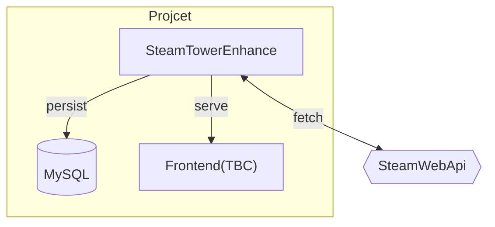

# SteamTowerEnhance

steam 个人数据观测塔 进阶版

### 项目功能

对公开数据进行加工

在此用户将获得:
- 更多维的个人数据展示
- 更有趣的数据观测角度
- 更实用的数据使用指标

### 项目构架
更新中


本项目为后端

### 所用技术

- 基于 JDK17
- 采用 SpringBoot 3.x 做基础架构
- 采用 MyBatis & MyBatisPlus 做 ORM
- 采用 Gradle 构建

### JVM 参数
```text
-Xms8G 
-Xmx8G
-XX:+UseZGC
-XX:+HeapDumpBeforeFullGC
-XX:+HeapDumpOnOutOfMemoryError
-XX:HeapDumpPath=/Users/$USER/Workspaces/IdeaProjects/steam-tower-enhance/heapdump/
```

### 开发进度

#### milestone 1
- [x] app basic
- [x] player basic
- [x] friends basic
- [ ] owned_games basic
- [ ] game_schema basic
- [ ] player_achievements basic
- [ ] global_achievements basic
- [ ] steam_level
- [ ] resolve_vanity_url
- [ ] number_of_current_players
#### milestone 2
- [ ] app function
- [ ] player function
- [ ] friends function
- [ ] owned_games function
- [ ] game_schema function
- [ ] player_achievements function
- [ ] global_achievements function
#### milestone 3
- [ ] frontend develop
